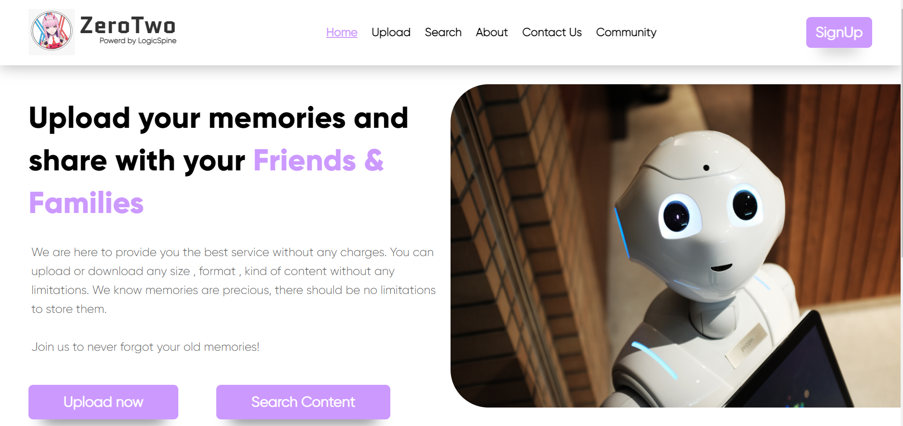
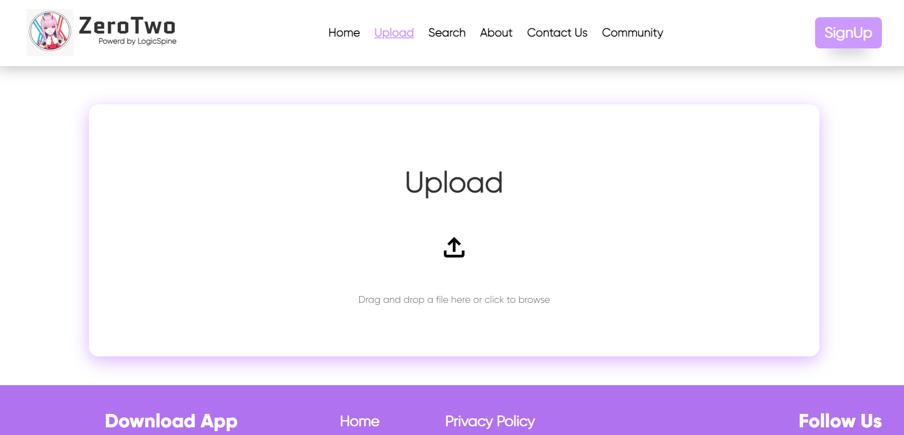
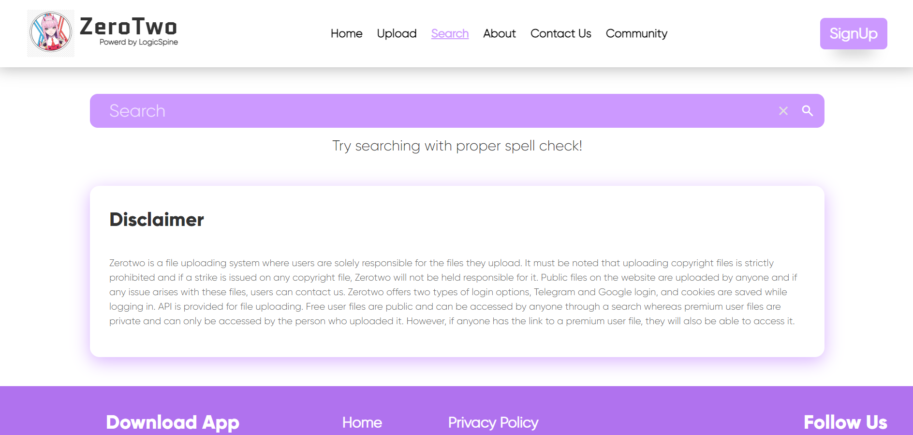
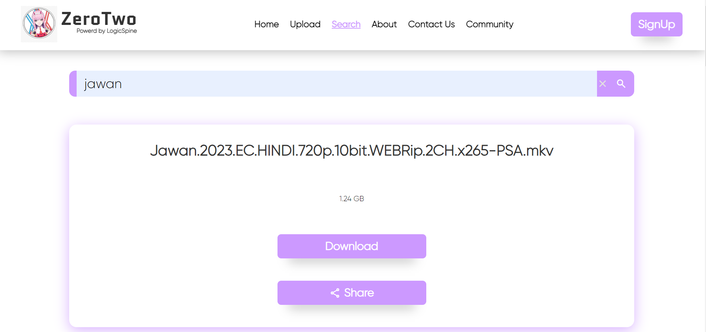
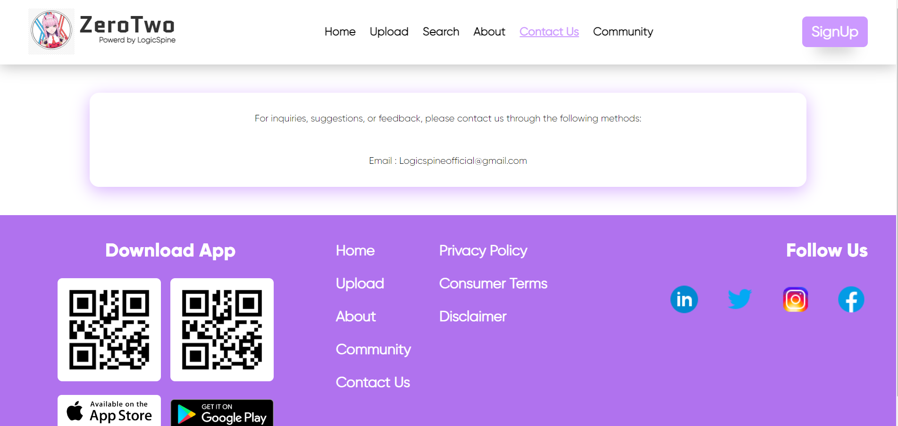
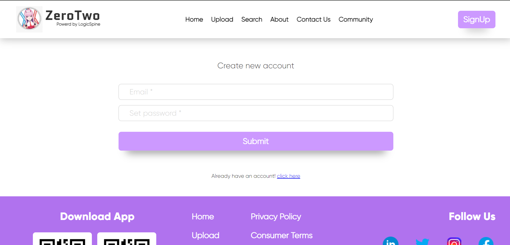
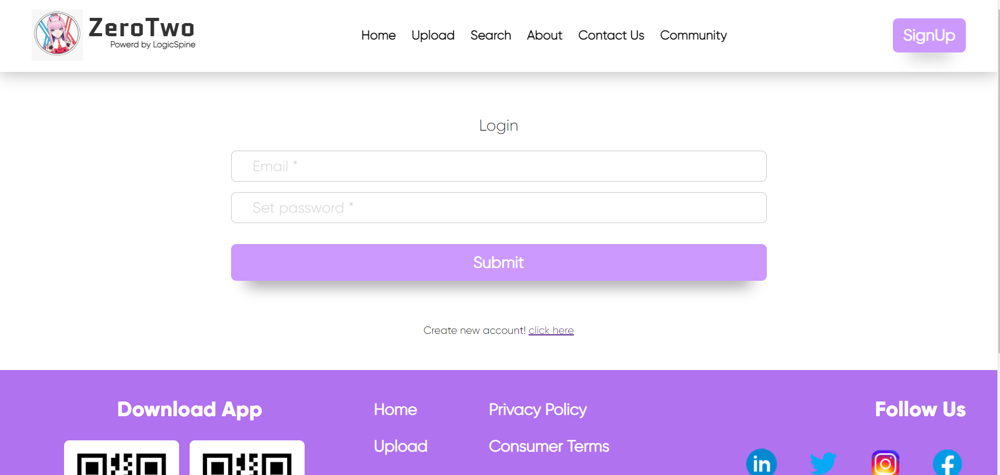

# ZeroTwo: Content Sharing Platform

Welcome to ZeroTwo, a content uploading and sharing platform designed to provide users with a seamless experience for sharing various types of content. Whether it's photos, videos, documents, or any other file format, ZeroTwo allows users to upload and share their content publicly or privately with ease.

## Screenshots

1. 
---
2. 
---
3. 
---
4. 
---
5.  
---
6. 
---
7. 

   
## Introduction

ZeroTwo aims to provide users with the best service without any charges. Users can upload or download any size, format, or kind of content without limitations. Memories are precious, and there should be no restrictions on storing them. With ZeroTwo, users can preserve their memories and share them with others effortlessly.

## Key Features

- **Unlimited Content Uploads**: Users can upload any amount of content without restrictions on size or format.
  
- **Public and Private Sharing**: Content can be shared publicly for anyone to access or privately with specific individuals.

- **Flexible Search**: Users can search for content by name, making it easy to find and access desired files.

- **User Accounts**: While browsing and downloading content is available to all users, having an account allows for unlimited uploads and personalized sharing options.

- **Google reCAPTCHA Integration**: To prevent scraping and ensure the security of user data, ZeroTwo implements Google reCAPTCHA to verify human interaction and thwart automated bots.

## Technologies Used

### Frontend

- **ReactJS**: Used for building the frontend user interface, providing a dynamic and interactive experience for users.

### Database

- **MongoDB**: Used for storing user account information, file metadata, and access permissions.

## Setup Instructions

To set up ZeroTwo locally, follow these steps:

1. Clone the repository to your local machine.
2. Navigate to the project directory and install dependencies for the frontend.
3. Start the frontend ReactJS application.
4. Access the application in your web browser and start uploading and sharing content.

## System Making Dedication

ZeroTwo was developed with a strong dedication to creating a robust and user-friendly content sharing platform. The system was carefully designed to handle large file uploads, ensure efficient content management, and provide a seamless user experience.

## Production Use and Open Source

This project is currently in use in production. However, the company that owns this product has shifted to another code base. As a result, this codebase is being made open-source for the sake of learning and community contribution.

## License

This project is not open-source and is intended for demonstration purposes only.
This codebase is still ownde by [LogicSpine](https://logicspine.com/).

---

Demo site is hosted on temp server. Take you change to see it live: https://dancing-paprenjak-7713df.netlify.app/
